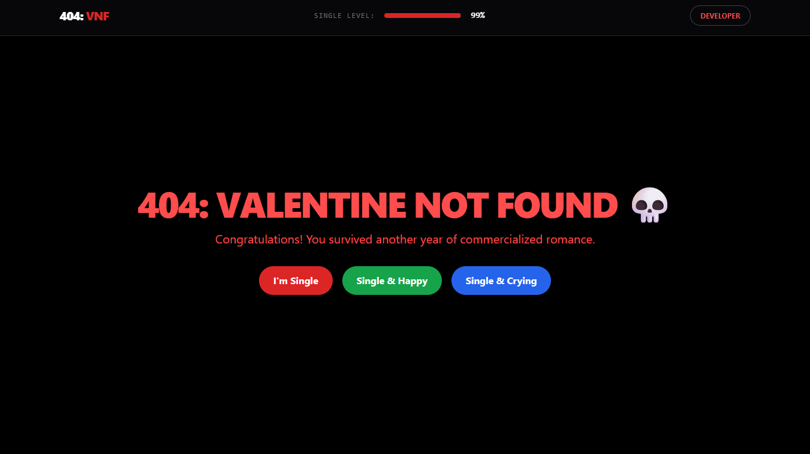

# 404: Valentine Not Found 💀

A high-performance, survival-themed web application built to navigate the "commercialized romance" season. This project features real-time state management, dynamic canvas generation, and a glassmorphism UI.

## 🚀 Live Demo
[Explore the Survival Guide](https://sayantan-pachal.github.io/choses_speciales/404-valentine-not-found)

## ✨ Advanced Features
* **Glassmorphism Navigation:** A fixed header with `backdrop-blur` that tracks your "Single Level" progress in real-time as you scroll.
* **Status Matrix:** Interactive state management where increasing "Self-Respect" mathematically reduces "Attachment Levels."
* **Canvas-Generated Certification:** A custom-built engine using **HTML5 Canvas API** to generate downloadable, timestamped "God Level" badges with verification stamps.
* **Dynamic Survival Kit:** Logic-based "Truth Bomb" generator with integrated YouTube search API for Arijit Singh mood-matching.
* **Celebration Logic:** Integrated `canvas-confetti` high-performance animations triggered by state thresholds.
* **Easter Eggs:** Keyboard-event listeners (Type `sayantan`) to trigger "Developer God Mode."

## 🛠️ Tech Stack
* **Frontend:** HTML5, Tailwind CSS (Utility-first styling)
* **Logic:** Vanilla JavaScript (ES6+ DOM Manipulation & State Management)
* **Graphics:** HTML5 Canvas API (Pixel-perfect image rendering)
* **Performance:** CDN-based library integration (FontAwesome, Canvas-Confetti)

## 📸 Technical Highlights
* **Smooth Navigation:** Includes an "Instant-Vanish" Back to Top utility.
* **Data Persistence:** Uses `localStorage` to remember user theme preferences across sessions.
* **Responsive Engine:** Fully mobile-optimized grid layouts using Tailwind's breakpoint system.

---
Developed by **Sayantan Pachal** | Computer Science Engineering Student
